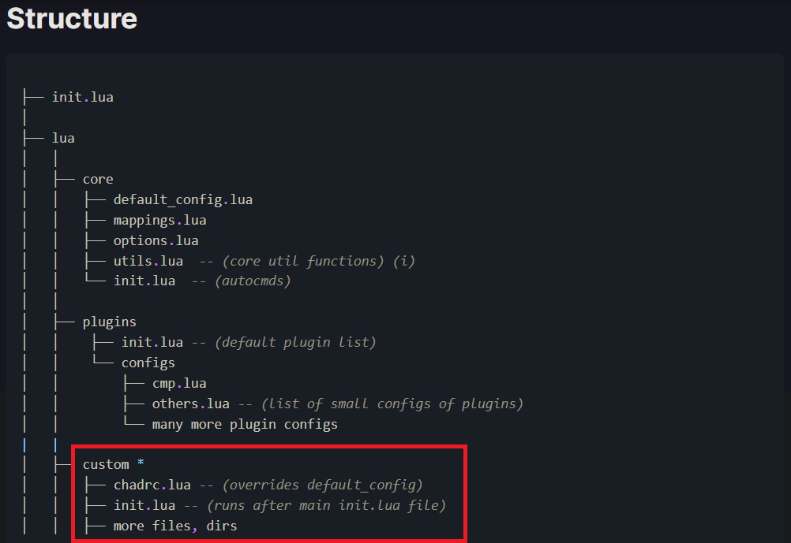

# Description

It is recommended to first start with a fresh neovim config to learn the basics of VIM as a modal editor.
Furthermore, the configuration is done in `LUA` language. Thus, it would be helpful to learn about some lua syntax to understand how everything is configured.

For more info about the core configuration, visit the NVCHAD [Documentation](https://nvchad.com/quickstart/install)

This repo may be cloned to extend the underlying nvchad neovim configs.

## Features

The features implemented with this configuration are:
- Custom nvchad themes
- Revamped status line 
- `Telescope` plugin for file explorer
- `Nvim tree` for file explorer similar to VSCode
- Syntax highlighting with `Treesitter`
- Neovim integration of `lazygit` for a git UI
- Custom Indent highlighting with `blankline`

# Requirements
1 -> Should have a nerd font installed for emojis
2 -> Lazygit should already be installed from the [github repo](https://github.com/jesseduffield/lazygit)
3 -> Basic understanding of Neovim

# Setup
i. Clone the nvchad repo
> `git clone https://github.com/NvChad/NvChad ~/.config/nvim --depth 1 && nvim`

ii. Remove the custom folder as shown in picture

iii. Clone my repo in the same directory; i.e the lua directory

iv. Since it has been configured such that the core features recognize only the `custom` directory, rename the folder to custom.

V. When re-entering neovim, do:
> `:PackerSync`
This will ensure that the new custom configs overwrite the nvchad core features.

# Main features explanation

### LEADER KEY in Neovim is 'Space'

## Telescope
Telescope is one of the core features of neovim in general. 
- It is responsible for file browsing. 
- It can show a preview of the file.
- Can search throughout the files according to words.

To display all the keymaps that have been set in normal mode:
> <leader>-tk

To preview themes and change:
> <leader>-th

To open file explorer and search based on file name:
> Alt-r

To open file explorer and search based on word in the file:
> Alt-f

